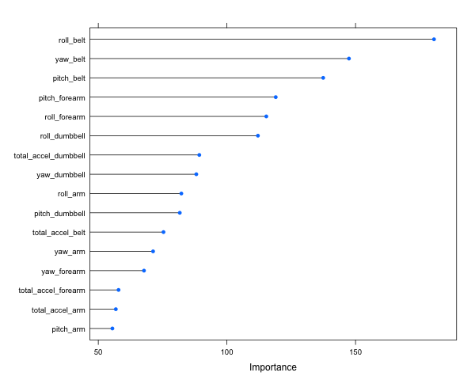
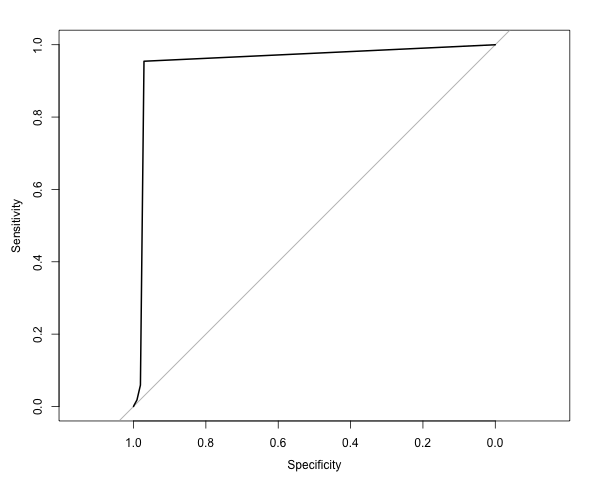

## A machine learning technique to identify incorrect form for a bicep curl exercise

This code predicts what common mistake is being made while performing a bicep curl. Since this code was written and executed in the context of a class the primary focus was to explore the various training options available and to familiarise oneself with the process of building and evaluating a machine learning algorithm.
The dataset used is generously available from the [Groupware@LES Human Activity Recognition project](http://groupware.les.inf.puc-rio.br/har). The dataset contains measurements from accelerometer+Gryroscope+Magnometer sensors located on the belt and dumbbell, as well on the forearm,arm and belt of the person performing the bicep curl. The dataset is large, of course not by today's big data standards. 

This document attempts to outline some of the thinking that directed the approach and the results I got.

### Exploratory analysis and feature selection
Preliminary exploration reveals the data is certainly large enough to not try to sift through it manually. 

```{R,eval=FALSE}
raw_d = read.csv("pml-training.csv")
dim(raw_d)
names(raw_d)
``` 
The 160 columns listed detail data from the five sensors along the x,y and z axis. Lessons from early Physics lesson ring a bell and I go hunting to convert the x,y and z vectors to their resultant vector. Along the way I discover there are cool packages in R to map cartesian coordinates to polar coordinates. I also realize that the raw accelerometer, gyroscope and magnometer data is very noisy. To get the orientation of the sensor all that is **theoretically** needed is the pitch, roll and yaw which is deterministically derived from the raw data. So some brief exploration is carried out with these columns only.  
While feature selection is not as much of a hardscience as classification I did attempt to use the var importance and corr matrices to narrow down the features.

```{R,eval=FALSE}
rel_cols= c("classe","roll_belt" ,"pitch_belt" ,"yaw_belt" ,"total_accel_belt" ,"roll_arm" ,"pitch_arm" ,"yaw_arm" ,"total_accel_arm" ,"roll_dumbbell" ,"pitch_dumbbell" ,"yaw_dumbbell" ,"total_accel_dumbbell" ,"roll_forearm" ,"pitch_forearm" ,"yaw_forearm" ,"total_accel_forearm")
library(dplyr)
raw_dt = raw_d %>% select(which(names(raw_d) %in% rel_cols))
str(raw_dt)
#Make sure there are no NAs
sum(is.na(raw_dt))
```
### Algorithms
Random Forests constantly feature amongst the top performing algorithms. They are especially good at solving problems that are more wide than long. Even though the pared down dataset is more long than wide a simple random forest model is built with the default parameters. This simple model is used to explore the importance of the various features I selected.  
The caret package is used.

```{R,eval=FALSE}
library(caret)
library(randomForest)
set.seed(713)
inTrain <- createDataPartition(y=raw_dt$classe, p=0.1, list=FALSE)
training <- raw_dt[inTrain,]

test_validation <- raw_dt[-inTrain,]
forCrossVal <- createDataPartition(y=test_validation$classe, p=0.5, list=FALSE)
x_validation <- test_validation[forCrossVal,]
test <- test_validation[-forCrossVal,]
dim(training); dim(x_validation); dim(test)
modFit <- train(classe~ .,data=training,method="rf",prox=TRUE)
modFit
```
### Out of sample error  
The above model is run on the set aside x_validation data set to determine the true "OOB" error. While the caret run does give you this the abundance of data available makes it easy to run a cross validation on the model. The results of this cross validation is as follows.

```{R,eval=FALSE}
pred <- predict(modFit,x_validation)
x_validation$predRight <- pred==x_validation$classe
table(pred,x_validation$classe)
```
Interestingly the OOB error in the crossvalidation was lower than the one predicted by the multiple caret runs. It was only about 5%. I am not sure why this is the case but I am willing to speculate that this is because of the controlled settting the data was carried out in. Any insigths/feedback on why this is the case would be appreciated. Please take care to note that this model does **NOT** make use of any features other than the pitch,roll,yaw and total acceleration from the data. All other "clues" like the window number and sampling instant and user name are all thrown out before training. The pitch,roll and yaw are derived of the raw sensor signals after having being filtered for noise and after going through a theortically sound transformation. I would argue that this is as much of the training raw data as anything else. Euler uses (three angles)[https://en.wikipedia.org/wiki/Euler_angles] to describe the orientation of a rigid body and that was almost three hundred years ago. The process of transforming raw sensor data to pitch, roll and yaw is well documented. 
```{R,eval=FALSE}
sum(!x_validation$predRight)/length(x_validation$predRight)*100
names(training)
```
When run on the test data approximately the same error rate is observed in the test data set. 
```{R,eval=FALSE}
pred <- predict(modFit,test)
test$predRight <- pred==test$classe
table(pred,test$classe)
confusionMatrix(pred, test$classe)
sum(!test$predRight)/length(test$predRight)*100
```

Here is a look at the variable importance in the final model.
```{R,eval=FALSE}
plot(varImp(modFit,scale=FALSE))
```


Taking a look at the ROC curve.
```{R,eval=FALSE}
myroc = pROC::roc(as.numeric(test$classe),as.numeric(pred))
pROC::plot.roc(myroc,col="blue",main="ROC curve of the resulting model")
```


Printing the tree.
```{R,eval=FALSE}
#I remove the first column to fit all the data in the width available
head(getTree(modFit$finalModel,labelVar=TRUE)[,-1],20)
```
L_daughter  R_daughter    split_var     split_point status prediction  
1               3  total_accel_forearm  37.5000000      1       <NA>  
2               5       pitch_dumbbell -12.0203759      1       <NA>  
3               7       pitch_dumbbell   0.3863375      1       <NA>  
4               9 total_accel_dumbbell  28.5000000      1       <NA>  
5              11     total_accel_belt  21.5000000      1       <NA>  
6              13            pitch_arm  43.8500000      1       <NA>  
7              15         roll_forearm -58.3000000      1       <NA>  
8              17            roll_belt 130.5000000      1       <NA>  
9              19 total_accel_dumbbell  35.5000000      1       <NA>  
10             21            roll_belt 122.5000000      1       <NA>  
11              0                 <NA>   0.0000000     -1          E  
12             23            roll_belt 130.5000000      1       <NA>  
13             25  total_accel_forearm  50.5000000      1       <NA>  
14             27     total_accel_belt  18.5000000      1       <NA>  
15             29     total_accel_belt  19.5000000      1       <NA>  
16             31           pitch_belt -42.9000000      1       <NA>  
17              0                 <NA>   0.0000000     -1          E  
18             33        pitch_forearm -34.6000000      1       <NA>  
19              0                 <NA>   0.0000000     -1          A  
20             35             yaw_belt  -6.7500000      1       <NA>  


Note that in this tree certain case for E is gotten to very early in the splitting process. This is reflected in the varImp plot above as well. "E" is when the participant throws their hip forward in which case the roll on the belt should give a good indication of this. Also note how the other branch of the tree defaults to A which is where the participant carries out the bicep curl correctly. As I would expect the E "classe" of errors are the easiest to spot.
